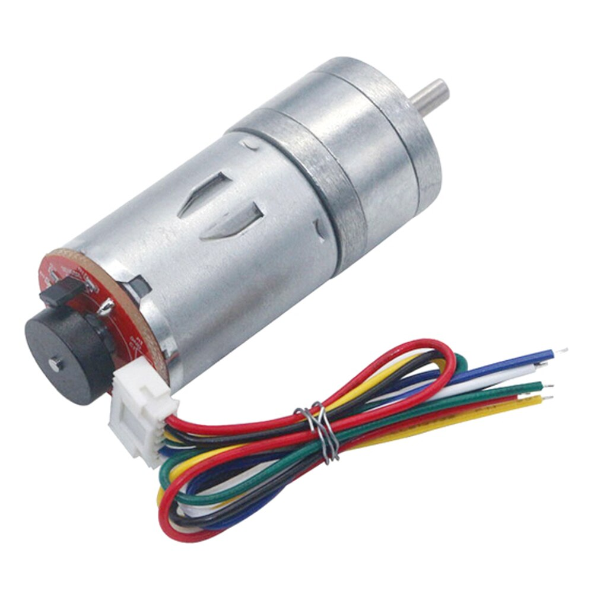
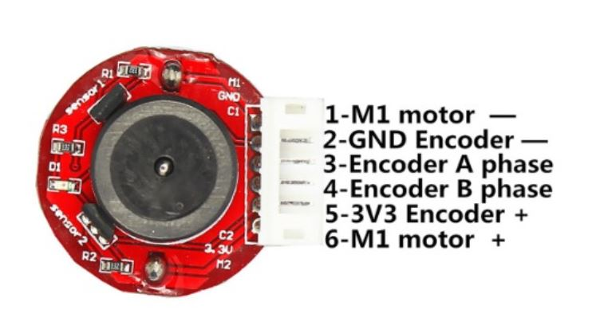
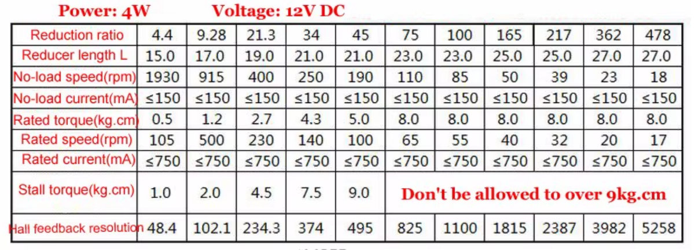
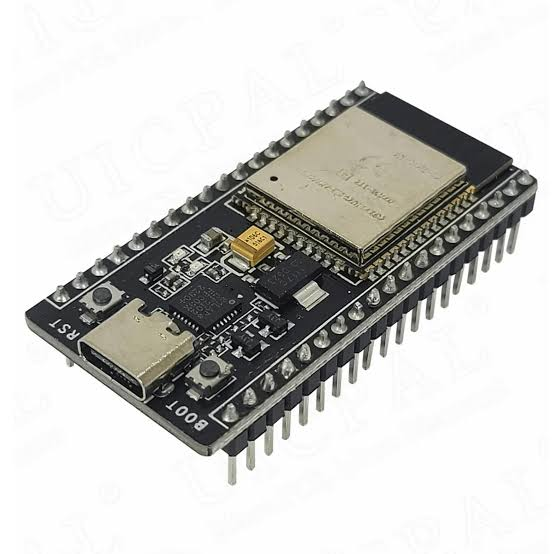
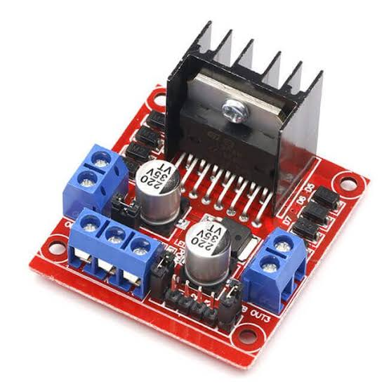
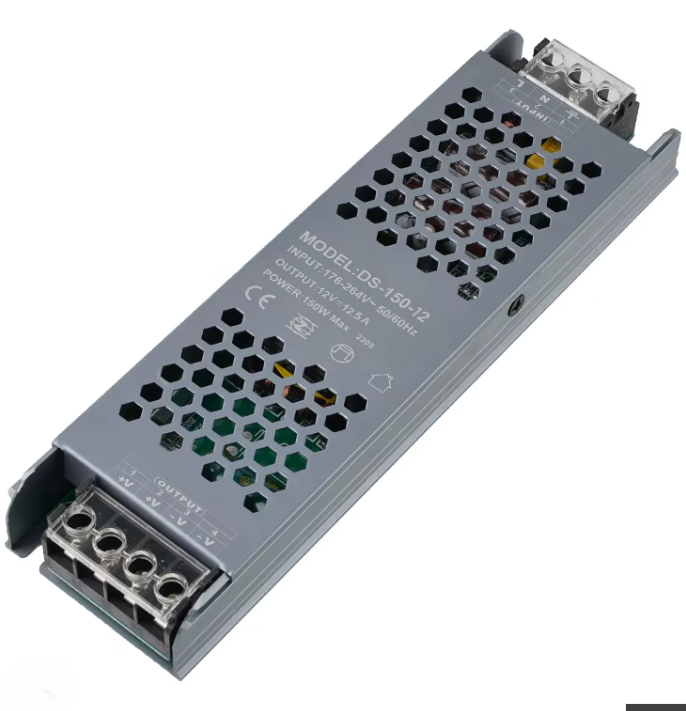
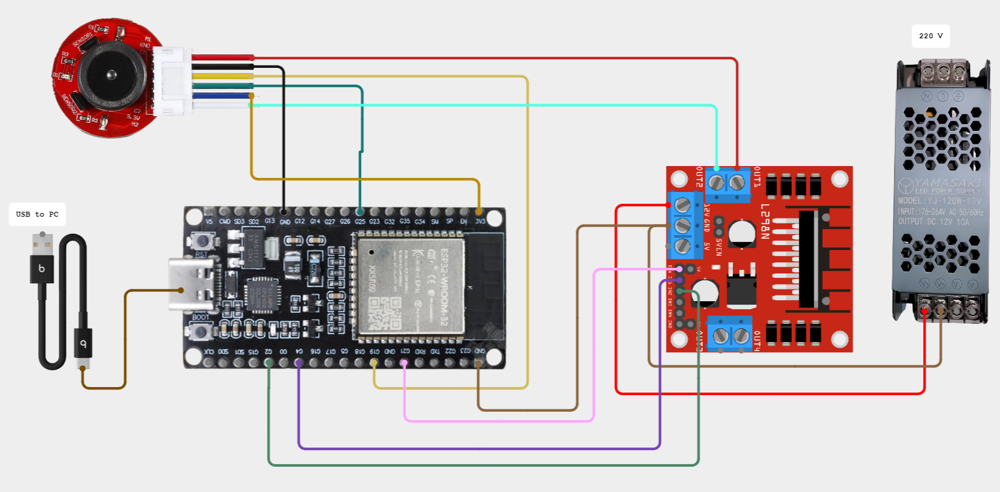

[← Volver al Menú Principal](../Readme.md)

# Módulo 00: Especificaciones de Hardware y Conexión Eléctrica

En esta sección se detalla la lista de componentes, las características técnicas del motor con encoder, el microcontrolador de control y el diagrama de conexionado eléctrico del sistema.

---

## 1. Lista de Materiales (BOM)

| Componente | Modelo / Especificación | Cantidad | Función Principal |
| :--- | :--- | :---: | :--- |
| **Motor DC con Reductora** | JGA25-371 (12V, 170 RPM, Relación 32:1) | 1 | Actuador electromecánico de la planta. |
| **Encoder de Cuadratura** | Sensor de efecto Hall (11 PPR en el eje del motor) | 1 (Integrado) | Sensor de realimentación de velocidad y posición. |
| **Microcontrolador** | ESP32-WROOM-32 (Versión NodeMCU 38 pines) | 1 | Procesamiento de algoritmos y lectura de encoder en Simulink. |
| **Driver de Potencia** | Módulo Puente H L298N | 1 | Modulación PWM y control de dirección de giro del motor. |
| **Fuente de Alimentación** | Regulada DC 12V (Capacidad mínima: 2A) | 1 | Alimentación de potencia del motor y driver. |
| **Cable de Comunicación** | Cable USB a USB-C con líneas de datos | 1 | Programación y comunicación serial / *External Mode*. |
| **Conexiones** | Cables tipo jumper (Macho-Hembra, Macho-Macho) | Varios | Enrutamiento de señales lógicas y de potencia. |

---

## 2. Motorreductor JGA25-371 con Encoder

El actuador principal es un motorreductor DC de imán permanente diseñado para sistemas mecatrónicos de precisión media.

### Características Técnicas Nominales
* **Voltaje de operación:** 12 V DC
* **Velocidad nominal en el eje de salida:** ~170 RPM
* **Relación de reducción de la caja de engranes:** $32:1$
* **Resolución base del encoder:** 11 pulsos por revolución (PPR) por canal en el eje primario del motor.

### 📐 Cálculo de Resolución Angular en el Eje de Salida
Para el lazo de control de posición y velocidad en Simulink, la resolución efectiva se calcula considerando la relación de reducción y la lectura de cuadratura (flancos de subida y bajada de los canales A y B, modo 4X):

$$\text{Pulsos por vuelta (eje de salida)} = 11 \times 32 = 352 \text{ pulsos/rev}$$

$$\text{Cuentas por revolución (CPR en 4X)} = 352 \times 4 = 1408 \text{ cuentas/rev}$$

$$\text{Resolución angular} = \frac{360^\circ}{1408} \approx 0.2557^\circ/\text{cuenta}$$

---

## 3. Microcontrolador: ESP32-WROOM-32 (38 Pines)

El ESP32 se encarga de generar la señal PWM, controlar la dirección del puente H y procesar las interrupciones del encoder para calcular la velocidad y posición angular. Se programa directamente desde Simulink utilizando el paquete de compatibilidad de hardware, mencionar que la version S3 de ESPE32 no es compatible con simulink .

* **Voltaje lógico de operación:** 3.3 V
* **Frecuencia de reloj:** 240 MHz (Dual Core)
* **Entradas con interrupción externa:** Todos los pines GPIO admiten interrupciones por hardware (Algunas versiones de ESPE32 como el S3 no es compatible con Simulink, por ello el modelo seleccionado fue el propeusto).

---

## 4. Etapa de Potencia: Driver Puente H L298N

Permite manejar la corriente y voltaje que demanda el motor a partir de las señales de control de bajo voltaje del ESP32.

* **Canal A habilitado (ENA):** Conectado al pin PWM del ESP32 para controlar el voltaje medio aplicado.
* **Entradas de control (IN1, IN2):** Control de sentido de giro (horario, antihorario, frenado dinámico).
* **Jumper de 5V interno:** Debe mantenerse colocado si el voltaje de alimentación de potencia no supera los 12V, lo que permite alimentar la lógica interna del L298N.

---

## 5. Fuente de Alimentación

* Se emplea una fuente conmutada/regulada de **12V DC a 2A** mínimo para evitar caídas de tensión bruscas cuando el motor experimente corriente de arranque o cambios rápidos de sentido de giro.

---

## 6. Diagrama y Tabla de Conexiones Eléctricas

### Tabla de Ruteo de Pines

| Origen (Componente) | Pin / Terminal | Destino (Componente) | Pin / Terminal | Función / Tipo de Señal |
| :--- | :--- | :--- | :--- | :--- |
| **Fuente 12V** | VCC (+) | **L298N** | Terminal 12V | Alimentación de potencia del motor |
| **Fuente 12V** | GND (-) | **L298N** | Terminal GND | Tierra de potencia |
| **L298N** | Terminal GND | **ESP32** | GND | **Tierra común (GND compartido imprescindible)** |
| **ESP32** | GPIO 21 | **L298N** | ENA | Señal PWM de modulación de velocidad |
| **ESP32** | GPIO 2| **L298N** | IN1 | Dirección de giro (Canal 1) |
| **ESP32** | GPIO 4| **L298N** | IN2 | Dirección de giro (Canal 2) |
| **L298N** | OUT1 | **Motor DC** | Terminal (+) | Alimentación de armadura |
| **L298N** | OUT2 | **Motor DC** | Terminal (-) | Alimentación de armadura |
| **ESP32** | Pin 3.3V | **Encoder Motor** | VCC | Alimentación lógica del sensor Hall |
| **ESP32** | GND | **Encoder Motor** | GND | Referencia de tierra del sensor |
| **Encoder Motor** | Canal A | **ESP32** | GPIO 25 *(ejemplo)* | Lectura de cuadratura (Interrupción) |
| **Encoder Motor** | Canal B | **ESP32** | GPIO 19 *(ejemplo)* | Lectura de cuadratura (Interrupción) |

---

## 7. ⚠️ Consideraciones de Ingeniería y Buenas Prácticas

1. **GND Común (Crítico):**  
   El terminal `GND` de la fuente de 12V, el terminal `GND` del driver L298N y el pin `GND` del ESP32 deben estar unidos físicamente. Si no comparten la misma referencia de tierra, las señales PWM del microcontrolador flotarán y el driver se comportará de forma errática.
2. **Nivel Lógico del Encoder (Protección del ESP32):**  
   Los pines del ESP32 toleran únicamente **3.3V**. Alimenta el encoder desde la salida de **3.3V del ESP32** (la mayoría de sensores Hall JGA25 operan entre 3.3V y 5V). Si decides alimentarlo a 5V, debes implementar divisores resistivos o un desplazador de nivel lógico (*Logic Level Shifter*) en los canales A y B para no dañar los GPIOs del microcontrolador.
3. **Desacoplo de Ruido:**  
   Si observas rebotes o conteo falso en el encoder debido al ruido electromagnético de las escobillas del motor, coloca condensadores cerámicos de $100\text{ nF}$ en paralelo entre los terminales del motor y su carcasa metálica.