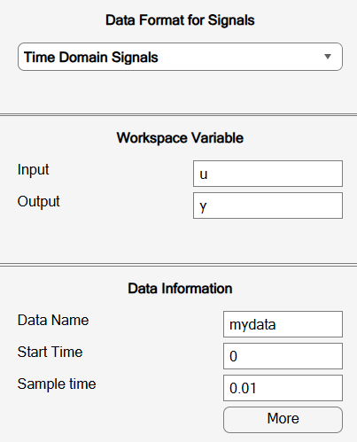
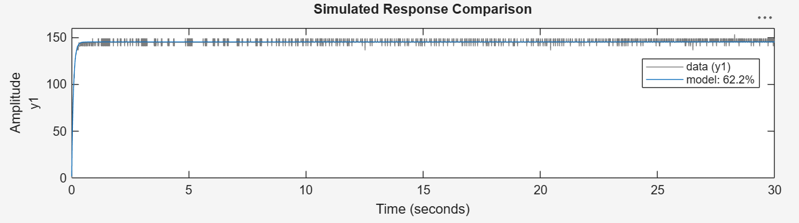
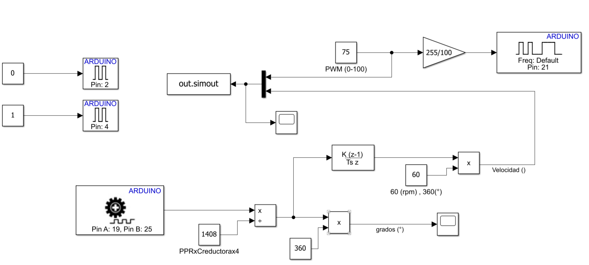

[← Volver al Menú Principal](../Readme.md)

# Módulo 01: Identificación de la Planta

En este módulo se documenta la identificación experimental de un motor de corriente continua (DC). El objetivo es obtener un modelo dinámico que relacione el voltaje aplicado a la armadura con la velocidad angular del motor.

## 1. Método de identificación

La identificación se realizó a partir de una prueba de escalón de voltaje y del análisis de la curva de reacción. Los datos experimentales se procesaron en MATLAB mediante la interfaz de **System Identification Toolbox**, que permitió estimar los parámetros de un modelo de primer orden.

La función de transferencia considerada fue:

$$
G(s) = \frac{\Omega(s)}{V(s)} = \frac{K}{\tau s + 1}
$$

Este modelo no incluye tiempo muerto, ya que la respuesta identificada se representó adecuadamente sin incorporar un retardo adicional.

## 2. Función de transferencia obtenida

El modelo estimado para la relación entre el voltaje de armadura y la velocidad angular fue:

$$
G_p(s) = \frac{\Omega(s)}{V(s)} = \frac{26.07}{s + 13.46}
$$

En la forma estándar de primer orden, este resultado equivale aproximadamente a:

$$
G_p(s) = \frac{1.94}{0.074\,s + 1}
$$

donde la ganancia estática es aproximadamente $K = 1.94$ y la constante de tiempo es aproximadamente $\tau = 0.074\ \text{s}$.

La configuración utilizada en **System Identification Toolbox** se muestra a continuación:

## 3. Resultados y validación

El modelo obtuvo un ajuste del **62.2 %** respecto a los datos experimentales. Este porcentaje debe interpretarse considerando las condiciones de la prueba y no como el único criterio para determinar la validez del modelo.

La prueba tuvo una duración aproximada de 30 segundos y la señal presentó oscilaciones durante la estabilización del motor. Estas condiciones pueden reducir el porcentaje de ajuste, aunque el modelo todavía reproduce de forma razonable la tendencia general de la respuesta.

La siguiente figura compara los datos experimentales con la respuesta del modelo estimado:

## 4. Diagrama de bloques en Simulink

Para la interacción con el hardware, se emplearon los bloques de lectura de encoder y modulación por ancho de pulsos (**PWM**) proporcionados por el paquete de soporte de Arduino en Simulink (*Simulink Support Package for Arduino Hardware*), los cuales son plenamente compatibles con el módulo **ESP32 WROOM-32** utilizado. Adicionalmente, se configuraron salidas digitales para controlar el sentido de giro del actuador a través del puente H.

El acondicionamiento de las señales sensoriales se realizó de la siguiente manera:

* **Posición angular:** Al realizar la lectura en cuadratura (detectando los cuatro flancos), la resolución resultante es de **1408 cuentas por revolución (CPR)**. Para convertir los pulsos brutos a unidades físicas, el conteo acumulado se divide entre $1408$ (obteniendo revoluciones) y posteriormente se multiplica por $360^\circ$ para registrar la posición angular en grados.
* **Velocidad angular:** El modelo y la adquisición operan con un tiempo de muestreo discreto de $T_s = 10\text{ ms}$. Para estimar la velocidad, se aplicó el bloque **Discrete Derivative** sobre la señal de posición en revoluciones dividida entre el periodo de muestreo. Finalmente, se escala por un factor de $60$ para obtener la velocidad en revoluciones por minuto (**RPM**) o, en su defecto, por $360$ en caso de requerir la salida en grados por segundo ($^\circ/\text{s}$). 

## 5. Archivos del módulo

* [`Identification.m`](./Identification.m): script utilizado para el procesamiento de los datos y la identificación.
* [`data_u_y_tf1.mat`](./data_u_y_tf1.mat): datos experimentales de entrada y salida.
* [`sistemIdentficationData.sid`](./sistemIdentficationData.sid): sesión exportada desde **System Identification Toolbox**.
* [`Ident_Planta.slx`](./Ident_Planta.slx): modelo de Simulink asociado a la identificación.
