[← Volver al Menú Principal](../Readme.md)

# Módulo 02: Control de Velocidad y Posición en Cascada

En este módulo se documenta el diseño, la simulación y la implementación experimental de las estrategias de control en lazo cerrado aplicadas al servomotor DC identificado en el [Módulo 01: Identificación de la Planta](../01_system_identification/README.md).

La nomenclatura del repositorio distingue dos entornos de trabajo:
* **`s_[nombre]`**: Modelos y algoritmos orientados exclusivamente a **simulación numérica**.
* **`q_[nombre]`**: Modelos configurados para **despliegue en tiempo real** sobre el hardware (*Hardware-in-the-Loop* / ejecución en placa).

---

## 1. Fundamentos del Control PID

El controlador Proporcional-Integral-Derivativo (**PID**) es la estructura de control retroalimentado más extendida en la industria debido a su equilibrio entre simplicidad conceptual y eficacia práctica:

$$
u(t) = K_p \, e(t) + K_i \int_0^t e(\tau) \, d\tau + K_d \, \frac{de(t)}{dt}
$$

* **Acción Proporcional ($K_p$):** Produce una acción correctiva proporcional al error instantáneo. Elevar su valor incrementa la velocidad de respuesta del sistema y reduce el error en régimen permanente, aunque valores excesivos provocan sobreimpulsos o inestabilidad.
* **Acción Integral ($K_i$):** Acumula el historial del error a lo largo del tiempo. Su propósito primario es eliminar por completo el error en estado estacionario ($e_{ss} \to 0$) ante entradas de tipo escalón o perturbaciones de carga constantes.
* **Acción Derivativa ($K_d$):** Responde a la tasa de cambio del error, anticipando la tendencia de la señal. Aporta amortiguamiento al lazo cerrado, mitigando sobreimpulsos y estabilizando transitorios abruptos frente a variaciones rápidas.

---

## 2. Lazo de Velocidad (Controlador PI)

Dado que la función de transferencia de velocidad identificada en el Módulo 01 corresponde a un sistema de primer orden:

$$
G_p(s) = \frac{\Omega(s)}{V(s)} = \frac{26.07}{s + 13.46} = \frac{1.94}{0.074\,s + 1}
$$

la acción derivativa resulta prescindible, pues amplificaría el ruido propio de la diferenciación numérica del encoder. Se adoptó por tanto una topología **PI en paralelo**.

### 2.1. Simulación Numérica (`s_control_vel.slx`)
El rango de la señal de control $u(t)$ se restringió entre **$-100\%$ y $+100\%$** mediante saturación dinámica con esquema *anti-windup*. La sintonización se llevó a cabo con la herramienta **Automated PID Tuning** de Simulink:

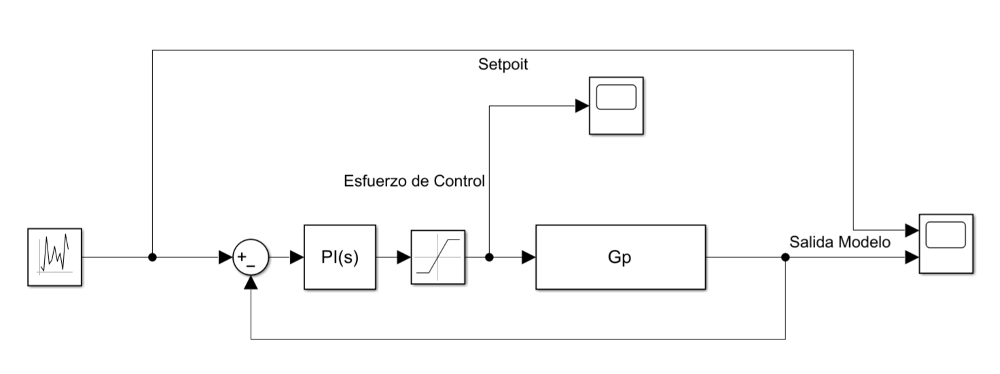

Los parámetros de sintonía resultantes fueron:
* **Ganancia Proporcional ($K_p$):** $0.86$
* **Ganancia Integral ($K_i$):** $14.4$

A continuación se muestra el seguimiento de referencia ante escalones bidireccionales y el esfuerzo de control demandado:

| Seguimiento de Velocidad (Setpoint vs. Modelo) | Esfuerzo de Control Simulado ($u$) |
| :---: | :---: |
| 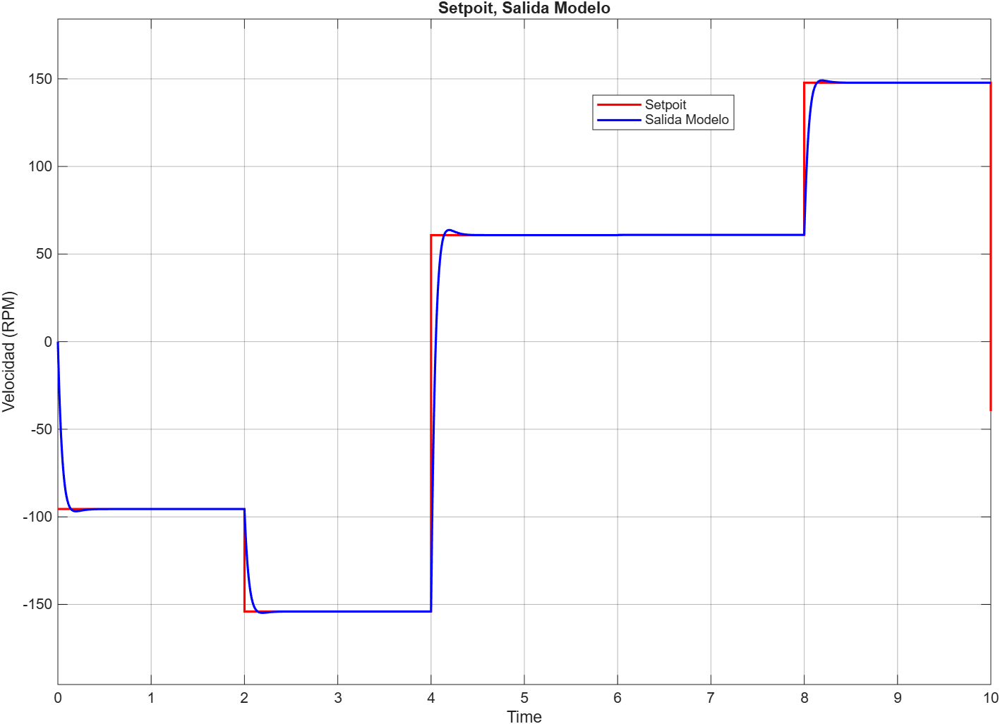 |  |

---

### 2.2. Implementación Experimental (`q_control_vel.slx`)

#### Lógica Bipolar de PWM y Sentido de Giro
Los puentes H reciben comandos de potencia no negativos ($0 \le \text{PWM} \le 255$) y señales lógicas discretas para determinar la polaridad. Para habilitar una acción de control continua en el intervalo $[-100\%, 100\%]$, se implementó la siguiente lógica de modulación:

1. **Magnitud de Potencia:** Se extrae el módulo $|u(t)|$ y se escala linealmente de $[0, 100]\%$ al registro de $8$ bits del microcontrolador $[0, 255]$.
2. **Polaridad y Conmutación:** Se evalúa la condición booleana $u(t) < 0$:
   * Si es **verdadera** ($1$), se activa la línea de inversión `DIR_A` y su complemento lógico ($0$) se transfiere a `DIR_B`.
   * Si es **falsa** ($0$), la dirección commuta al sentido horario directo.

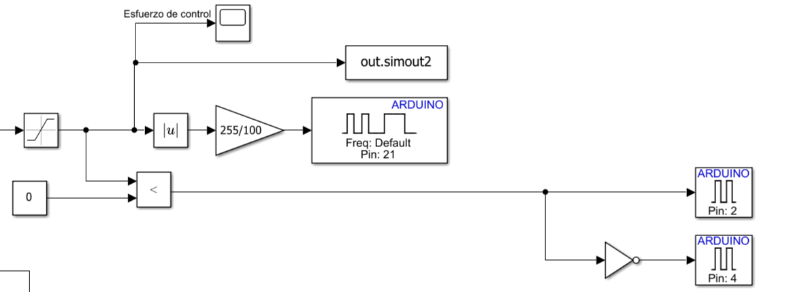

#### Despliegue en Hardware
El algoritmo se ejecutó en el módulo **ESP32-WROOM-32** a un periodo de muestreo discreto de $T_s = 10\text{ ms}$, conservando los parámetros sintonizados en la etapa analítica ($K_p = 0.86$, $K_i = 14.4$).

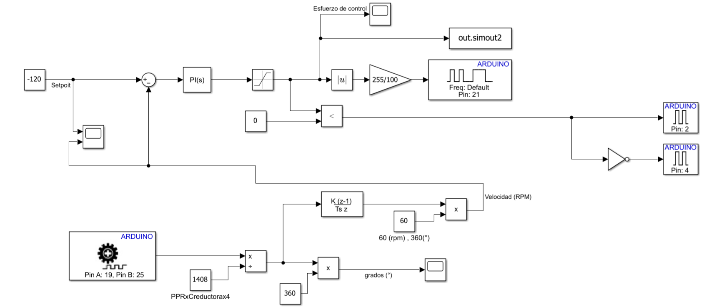

| Seguimiento Experimental (Setpoint vs. Medición) | Esfuerzo de Control Real ($u$) |
| :---: | :---: |
| 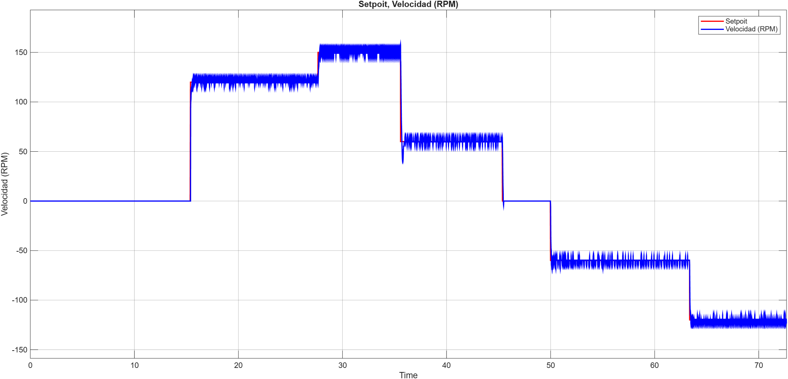 | 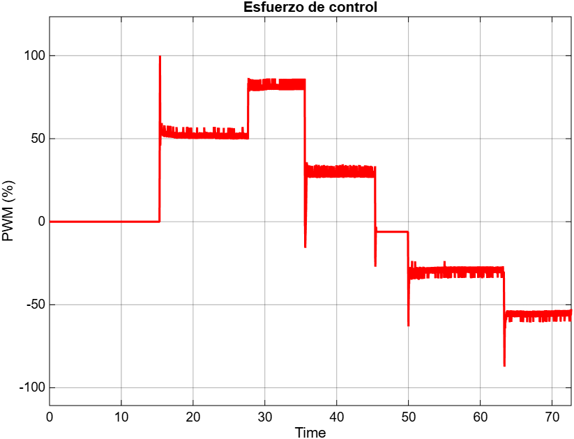 |

---

## 3. Arquitectura de Control de Posición en Cascada

Una vez validado el lazo de velocidad, se diseñó un lazo externo para el control de posición angular ($\theta$).

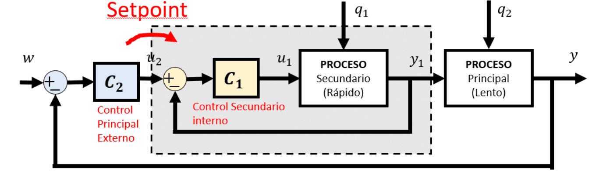

Para profundizar en los fundamentos del control en cascada, consulte [Control Automático Educación](https://controlautomaticoeducacion.com/control-realimentado/control-en-cascada/).

### Justificación de la Arquitectura
* **Lazo Interno (Velocidad):** Actúa con alta dinámica temporal, neutralizando fluctuaciones de par, efectos de fricción no lineal y perturbaciones de carga antes de que se reflejen en la posición angular.
* **Lazo Externo (Posición):** Genera la consigna de velocidad angular para el lazo esclavo. Al saturar su salida entre **$-10^\circ/\text{s}$ y $+50^\circ/\text{s}$**, se limita físicamente la velocidad máxima del eje, evitando sobreoscilaciones mecánicas severas y sobrecalentamiento del actuador.
* **Dominio Discreto:** El controlador de posición se implementó directamente en tiempo discreto ($T_s = 10\text{ ms}$). Implementar derivadores en tiempo continuo bajo frecuencias de muestreo moderadas suele inducir inestabilidades numéricas y derivaciones espurias de ruido.
* **Conversión de Unidades:** Para la compatibilidad del modelado en simulación, la salida del modelo de velocidad se reescaló de $\text{RPM}$ a grados por segundo ($^\circ/\text{s}$) mediante la relación:

$$
\omega\ [^\circ/\text{s}] = \omega\ [\text{RPM}] \times \frac{360^\circ}{60\text{ s}} = \omega\ [\text{RPM}] \times 6
$$

### Parámetros de Sintonización en Cascada
Ambos compensadores se calcularon mediante optimización paramétrica con la herramienta **PID Tuner**:

* **Lazo Interno (PI de Velocidad):**
  * $K_p = 0.057$
  * $K_i = 1.55$
* **Lazo Externo (PD Discreto de Posición):**
  * $K_p = 21.7$
  * $K_d = 1.82$

---

### 3.1. Resultados en Simulación (`s_posicion_cascada.slx`)

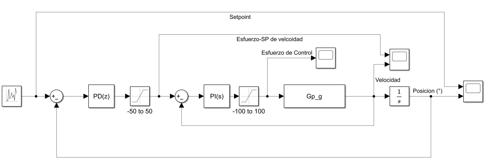

A continuación se exhibe el comportamiento simultáneo del lazo primario, del lazo secundario y de la señal de accionamiento:

| Lazo Externo: Setpoint vs. Posición ($\theta$) | Lazo Interno: Velocidad y Referencia ($\omega$) | Esfuerzo de Control al Actuador ($u$) |
| :---: | :---: | :---: |
| 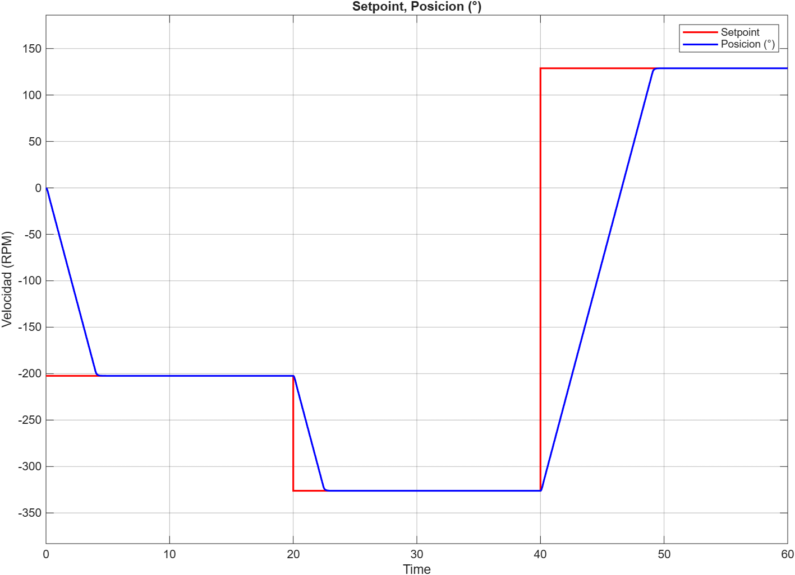 | 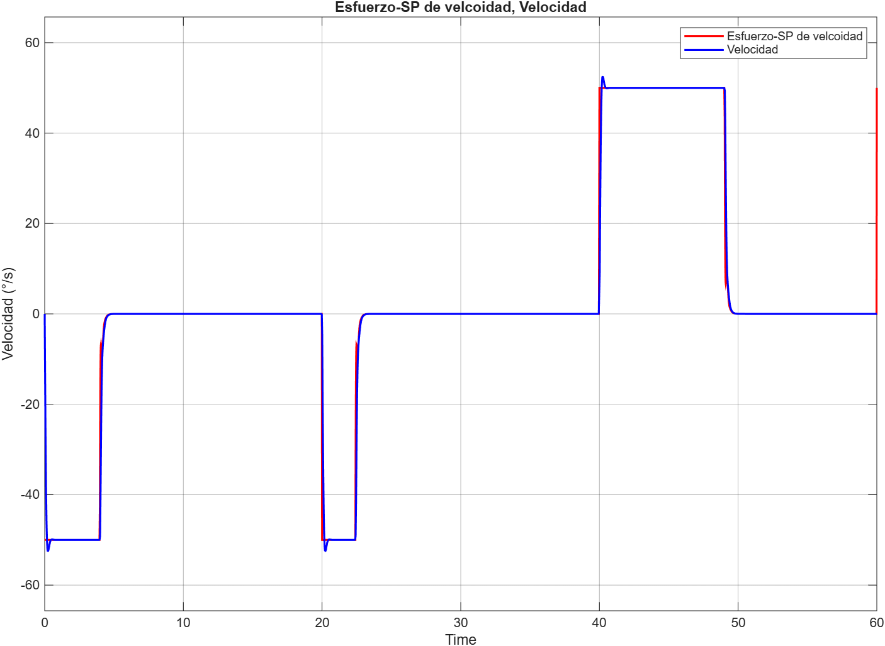 | 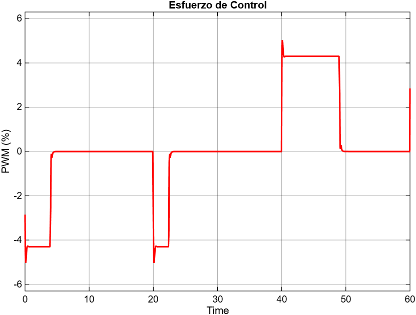 |

---

### 3.2. Resultados en Implementación Experimental (`q_posicion_cascada.slx`)

Se cargó el modelo completo en el ESP32 conservando los parámetros de sintonización y las cotas de saturación de velocidad probadas en simulación:

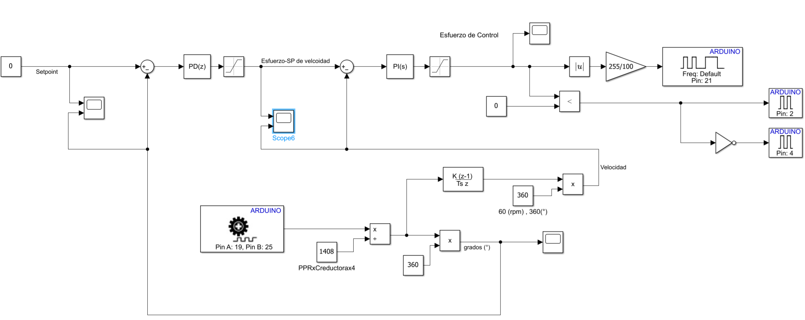

| Lazo Externo: Seguimiento de Posición ($\theta$) | Lazo Interno: Respuesta de Velocidad ($\omega$) | Esfuerzo de Control Real ($u$) |
| :---: | :---: | :---: |
| 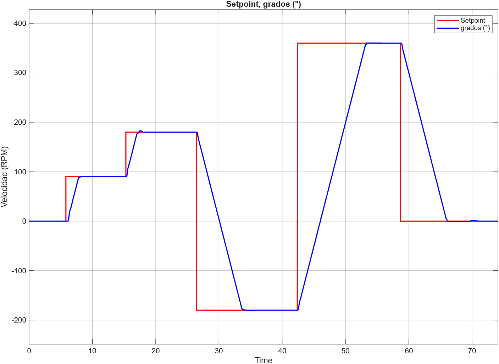 | 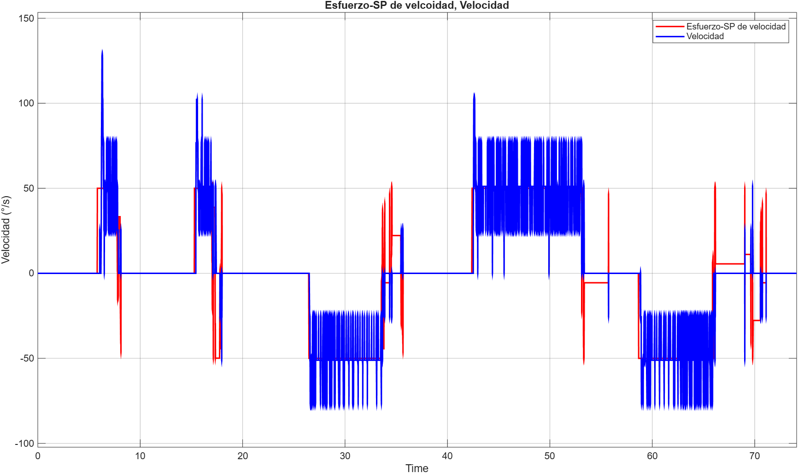 | 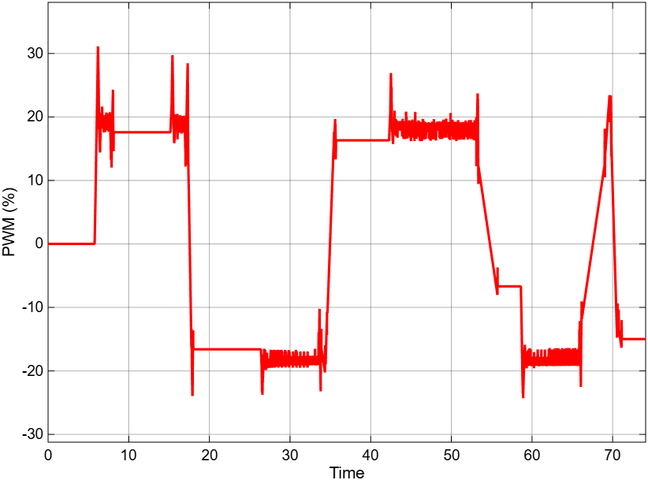 |

---

## 4. Conclusiones

* **Validez del Modelado Dinámico:** La correspondencia entre las curvas de simulación numérica y las respuestas adquiridas sobre el hardware real confirma que el modelo de primer orden obtenido en el Módulo 01 describe satisfactoriamente la dinámica dominante de la planta.
* **Ventajas de la Sintonización Analítica:** El diseño de compensadores soportado en la función de transferencia y en herramientas de optimización paramétrica en Simulink eliminó el ajuste empírico por prueba y error, reduciendo el riesgo de saturación mecánica y oscilaciones sostenidas durante las pruebas iniciales de banco.
* **Eficacia del Esquema en Cascada:** La saturación explícita de la consigna del lazo interno de velocidad demostró ser una técnica eficaz para acotar la aceleración angular y eliminar el sobreimpulso en las transiciones de posición angular.

---

